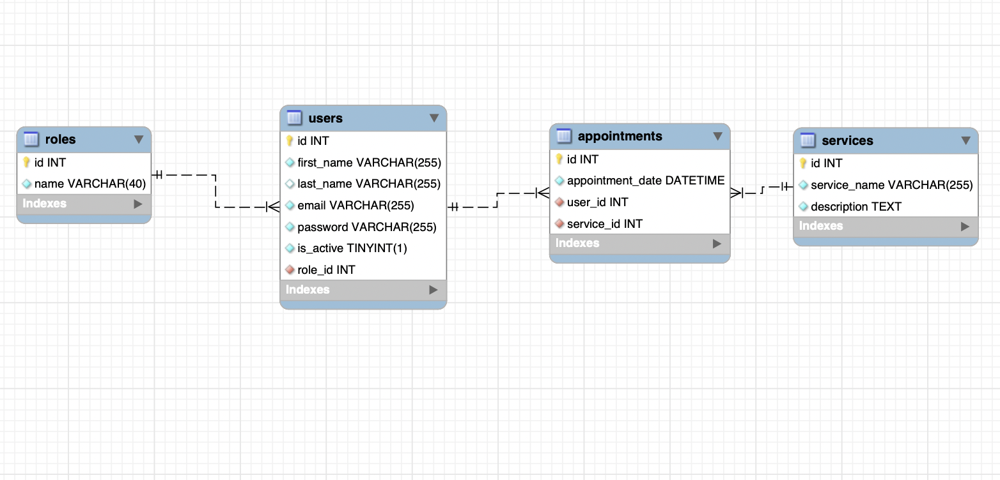

<em> Bienvenidos a mi primer proyecto Backend </em>

### Backend Estudio Tattoo

<details>
  <summary>Contenido </summary>
  <ol>
  <li><a href="#Objetivo">Objetivo</a></li>

  <li><a href="#sobre-el-proyecto-🔎">Sobre el proyecto</a></li>
  <li><a href="#Stack-🚀">Stack</a></li>
  <li><a href="#Diagrama">Diagrama</a></li>
  <li><a href="#Licencia">Licencia</a></li>
  <li><a href="#Instalacion">Instalación</a></li>
  <li><a href="#Webgrafia">Webgrafia</a></li>
  <li><a href="#Contacto">Contact0</a></li>
  </ol>
</details>

## Objetivo-🎯

Crear un sistema de gestión de citas para un estudio de tatuajes.

## Sobre el proyecto-🔎

El cliente deberá ser capaz de registrarse en la aplicación, hacer login y acceder a su área de cliente, todo ello visualmente desde el navegador.
citas: modificarlas y anularlas.
Podrá crear citas con tatuadores y cada tatuador tendrá
un portfolio de tatuajes,

También existirá una zona de usuario con sus datos personales, que solo
podrá ver él mismo.

## Stack 🚀 🚀

MySQL 

JavaScript 

🛠️ TypeORM, ES6 Javascript, API REST
Docker, MySQL , TS, funcionalidad de async/await

<a href="https://www.expressjs.com/">
    
</a>
<a href="https://nodejs.org/es/">
    
</a>

## Diagrama BD



Registro de usuarios

● Login de usuarios

● Perfil de usuario

● Modificación de datos del perfil

● Creación de citas

● Editar citas

● Eliminación de citas

● Ver todas las citas que tengo como cliente (solo las propias)

● Ver todas las citas existentes (role tatuador).

● Listar tatuadores

## Licencia

Este proyecto se encuentra bajo licencia de "Mi Nombre"

# Endpoints principales

- AUTH

  - REGISTER

          POST http://localhost:3000

    body:

    ```js
       {
       "id":41
         "firstName":"Cristiano"
         "lastName":"Ronaldo"
         "email":"cronaldino@gmailcom",
         "password":xx

         }
    ```

  - LOGIN

          POST

    body:

    ```js
        {
            "id":41
         "firstName":"Cristiano"
         "lastName":"Ronaldo"
         "email":"cronaldino@gmail.com"
         "password":xx
        }
    ```

- - DETALLES DEL PERFIL- RUTA

          GET   `/api/users/profile`

  - ...

## Instalación en local

Sigue estos pasos para instalar y ejecutar el proyecto localmente:

1.  Clona este repositorio: `git clone`
2.  Instala las dependencias: `npm install`
3.  Inicia la aplicación: `npm start`
4.  Instala dependencias `package json` `gitgnore`
    y modulos node: `node modules`
5.  Conectamos nuestro repositorio con la base de datos -en mi caso utlilize imagenes de Docker -mysql

6.  Ejecutamos las migraciones, seguimos con los Factories y Models y poblamos la DB por medio de los seeders en mi caso he realizado un archivo mysql en workbench por separado.
7.  Ejecutamos el servidor `npm run dev`
8.  Comenzamos a definir las rutas en los ficheros routes y el CRUD.
9.
10.

## Webgrafia:

Para desarrollar este proyecto puedes consultar en:

<a href="https://typeorm.io/" target="_blank"> Documentación TypeORM</a>

<a href="https://jwt.io/" target="_blank"> Documentación Json Web Token</a>

<a href="https://fakerjs.dev/" target="_blank"> Faker Data Generator </a>

## Contact 👩🏽‍💻

<a href="https://www.linkedin.com/in/marissarico" target="_blank"> </a>
